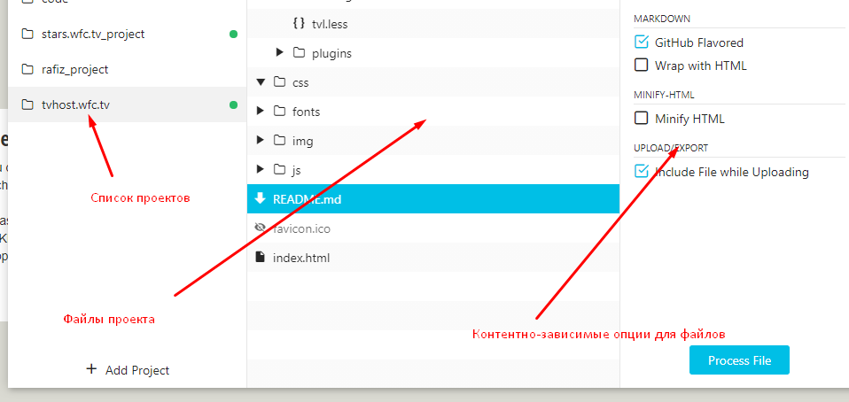

# README #

Лендинг поиска для Тик-Ток [https://ttstars.wfc.tv/](https://ttstars.wfc.tv/)

## Сборка проекта ##

Для сборки проекта используется утилита **Prepros** [https://prepros.io](https://prepros.io). Для запуска проекта достаточно перетащить папку с проектом в сборщик. Утилита условно-бесплатная (появляется несколько навязчивое всплывающее окно с предложением купить), но функционал доступен полностью. 

Конфигурация сборщика прописана в файле **prepros.config**. Файл ни в коему случае не удалять и не править вручную, правки вносятся самой утилитой, через GUI.

В *.gitignore* вообще ничего не прописывать, кроме папки *npm_modules*, если такая появится. Всё что есть, всё нужно.

ВНЕ папки **__src** ничего не править, ни стилей, ни скриптов, ни текстов.

## Технологии ##

* Для *HTML* используется *KIT* [https://codekitapp.com/help/kit/](https://codekitapp.com/help/kit/)
* Для *CSS* используется *LESS* [http://lesscss.org](http://lesscss.org)
* *JS* бандлятся в один файл, кроме тех, что тянутся с CDN. Подробнее - [https://prepros.io/help/bundle-javascript](https://prepros.io/help/bundle-javascript)

